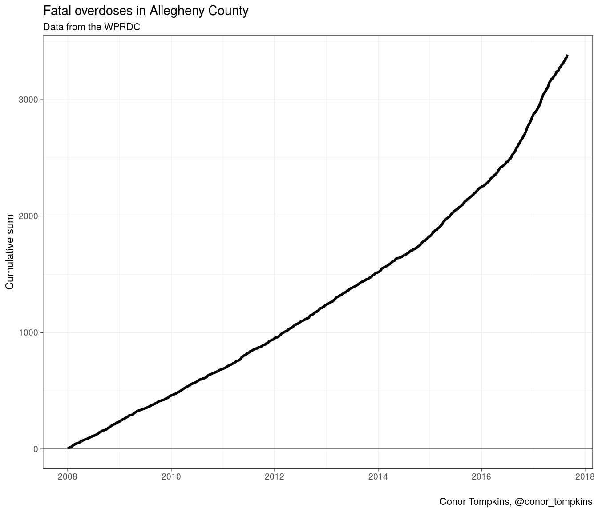

allegheny\_overdoses
====================

A repo for analyzing fatal overdoses in Allegheny County

Basic exploratory analysis
--------------------------

``` r
library(tidyverse)
library(scales)
library(viridis)
library(ggrepel)
library(scales)

theme_set(theme_bw(base_size = 18))

source("scripts/load_data.R")
```

``` r
df %>% 
  filter(date <= "2017-09-01") %>% 
  count(date) %>% 
  mutate(n_cumsum = cumsum(n)) %>% 
  ggplot(aes(date, n_cumsum)) +
  geom_hline(yintercept = 0) +
  geom_line(size = 2) +
  labs(title = "Fatal overdoses in Allegheny County",
       subtitle = "Data from the WPRDC",
       y = "Cumulative sum",
       x = "",
       caption = "Conor Tompkins, @conor_tompkins")
```


